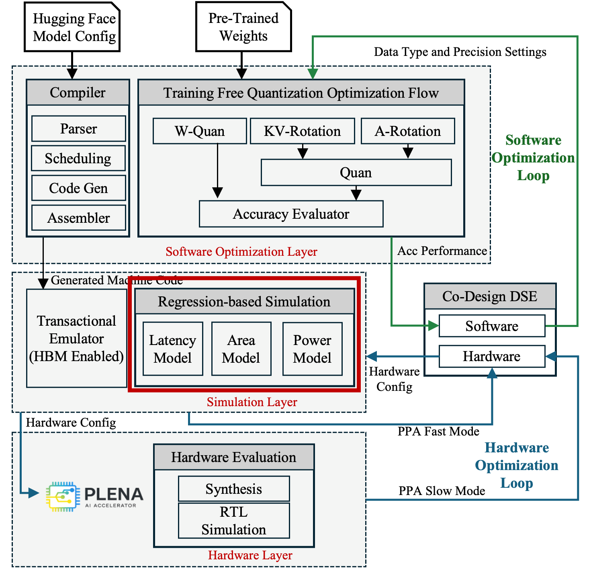

# Analytic Model

  
  
<em>The regression-based analytic models within the PLENA toolchain.</em>

The Analytic Model is PLENA's fast, closed-form cost estimator. It provides performance, area, and power numbers directly from a hardware configuration without running the transactional emulator or RTL synthesis, so the co-design search loop can sweep thousands of candidate configurations cheaply.

## Performance Analytic Model

The performance model estimates the number of instructions executed and combines them with the average cycle count for each instruction to derive overall performance, including latency and throughput.

It can report TTFT and TPS for any given configuration and workload, and it supports transformer, MoE, and dLLM models.

## Area and Power Model

Analytical cost functions are used to estimate on-chip area and power, calibrated against hardware synthesis results.

They are derived through curve fitting based on hardware synthesis results generated by Synopsys Design Compiler tools.