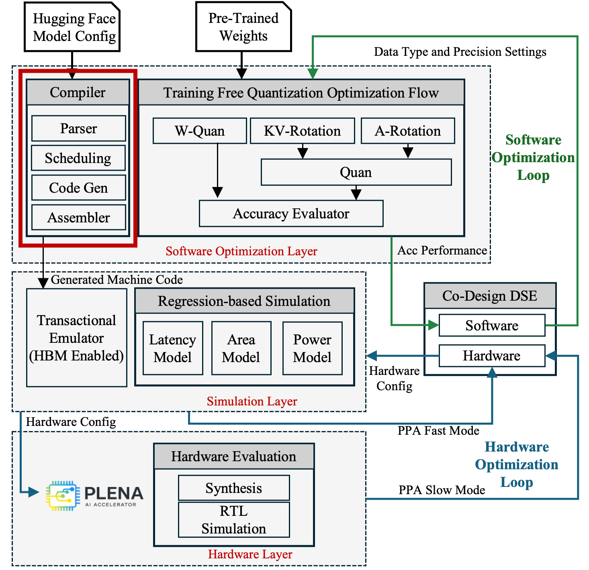

# Compiler

  
  
<em>The Compiler within the PLENA toolchain.</em>

PLENA provides two compiler approaches.

- **Direct-mapping compiler:** This compiler uses handwritten templates and maps the model directly to predefined templates for each layer. The templates are highly configurable and support different hardware configurations and layer dimensions. For example, a linear layer can be mapped to a configurable linear-layer template.

- **ATen-based compiler:** This compiler is built on ATen and provides a more general compilation flow as another path for lowering models onto the PLENA stack.
