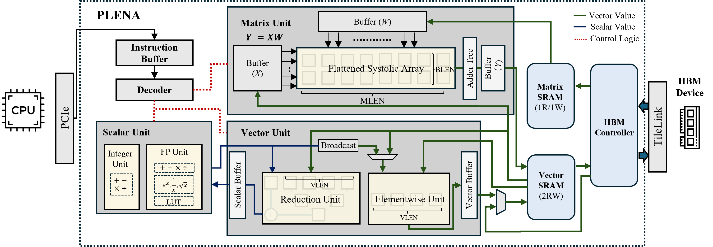
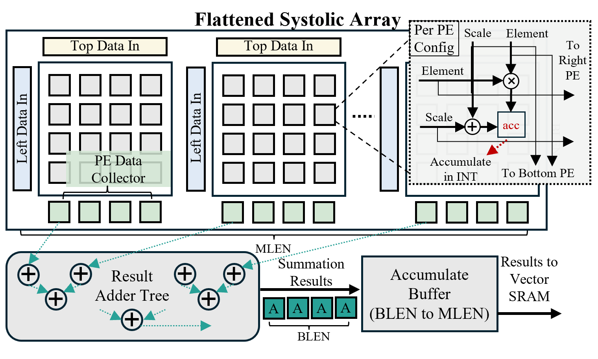
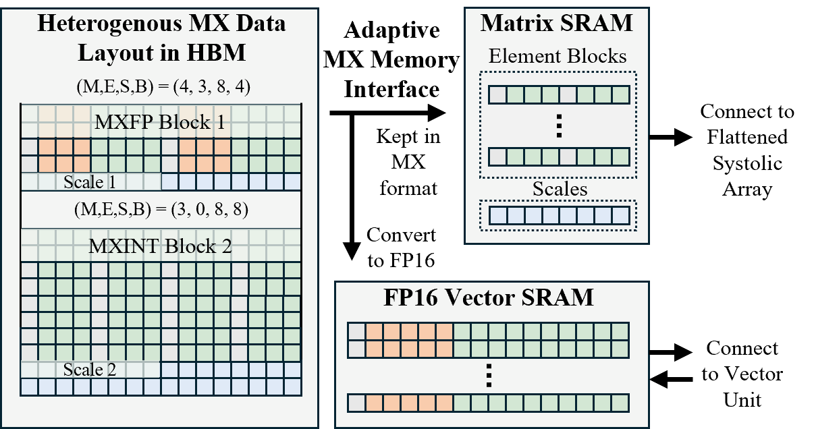

# PLENA Hardware Configuration

## Architecture Overview

PLENA is composed of the following major components:

- Matrix Unit: Handles GEMM, GEMV, and batched matrix multiplication (BMM) operations.
- Vector Unit: Supports vector operations.
- Scalar Unit: Supports integer and floating-point scalar operations, including special functions such as `exp`, `reci`, and `sqrt`.
- Matrix SRAM: Stores matrix data and connects directly to the Matrix Unit. It supports both transposed and non-transposed reads.
- Vector SRAM: Stores vector data and connects directly to the Vector Unit. It also acts as scratchpad memory for both the Matrix Unit and Vector Unit.
- Integer SRAM: Stores integer data, primarily address-related data.
- FP SRAM: Stores floating-point data and connects directly to the Scalar Unit.
- HBM Controller: Manages HBM access, including prefetch and writeback operations, using TileLink as the protocol.

---

## Compute Units

The compute subsystem consists of the Matrix, Vector, and Scalar units, orchestrated around a shared register file and parameterized by the core tile dimensions.

### Core Parameters

| Parameter | Value | Description | Tunable Range |
|-----------|-------|-------------|---------------|
| MLEN | 64 | Tile size of Matrix Unit | [2, 4, ..., 1024] |
| VLEN | 64 | Tile size of Vector Unit | [2, 4, ..., 1024] |
| BLEN | 4 | Tile size of Block Unit (output tile granularity) | [2, 4, ..., 64] |
| HLEN | 16 | Tile size of partitioned Matrix Unit (head dimension for partitioned attention) | [32, ..., 256] |

### Matrix Unit

The Matrix Unit is a systolic array that executes all dense linear-algebra primitives: GEMM (`M_MM` / `M_TMM`), GEMV (`M_MV` / `M_TMV`), and batched/partitioned matmul for multi-head attention (`M_BMM` / `M_BTMM`). Each GEMM call fetches a `(BLEN, MLEN)` tile from Vector SRAM and a `(MLEN, BLEN)` tile from Matrix SRAM, multiplies them, and accumulates the partial product inside the array. Results are drained to Vector SRAM in `BLEN × BLEN` chunks via `M_MM_WO`. The transposed variants (`M_TMM`, `M_TMV`) read the Matrix SRAM tile with a transposed address pattern, which lets the hardware consume HBM weights that are stored as `W.T` without an explicit transpose pass.

**Relevant parameters:**

- **MLEN** — Size of a square weight tile and the inner (K) dimension of each matmul step. Also sets the length of the accumulator row used by `M_MV` / `M_TMV`.
- **BLEN** — Output tile granularity. The array produces `BLEN × BLEN` results per drain and walks the K dimension in `BLEN`-column (or `MLEN × BLEN`-row, for transposed) strides.
- **HLEN** — Head tile size for partitioned attention. `M_BMM` / `M_BTMM` run `MLEN / HLEN` independent matmuls in parallel along this axis, mapping multi-head batches onto the array.

### Vector Unit

The Vector Unit operates on `VLEN`-wide vectors held in Vector SRAM and is responsible for all element-wise and reduction work that sits between matmuls: element-wise add/sub/mul with either another vector (`V_ADD_VV`, `V_SUB_VV`, `V_MUL_VV`) or a broadcast FP scalar (`V_ADD_VF`, `V_SUB_VF`, `V_MUL_VF`); element-wise nonlinearities `V_EXP_V` and `V_RECI_V` used by softmax, GELU, and layer norm; and cross-lane reductions `V_RED_SUM` and `V_RED_MAX` that collapse a `VLEN`-vector into an FP register. A mask register (`C_SET_V_MASK_REG`) can predicate any element-wise op, and an `rorder` flag lets `V_SUB_VF` run as `scalar − vector` for negation.

**Relevant parameters:**

- **VLEN** — Width of every vector operation and the natural granularity for Vector SRAM addressing (all vector read/write addresses must be `VLEN`-aligned). It also fixes the reduction width of `V_RED_SUM` / `V_RED_MAX`.
- **BROADCAST_AMOUNT** — Fan-out used when a single FP register is broadcast across the `VLEN` lanes in `V_*_VF` instructions.

### Scalar Unit

The Scalar Unit handles control-flow arithmetic and the small amount of FP math that lives outside the vector lanes. It covers integer ops on `gp0–gp15` (`S_ADD_INT`, `S_ADDI_INT`, `S_SUB_INT`, `S_MUL_INT`, `S_LUI_INT`) used for address computation and loop bookkeeping; FP ops on `f0–f7` (`S_ADD_FP`, `S_SUB_FP`, `S_MUL_FP`, `S_MAX_FP`) plus the special functions `S_EXP_FP`, `S_RECI_FP`, and `S_SQRT_FP` that back softmax normalizers and RMSNorm scales; and loads/stores against two small scratch memories — `INT_MEM` (via `S_LD_INT` / `S_ST_INT`) for integer constants and `FP_MEM` (via `S_LD_FP` / `S_ST_FP`) for preloaded FP constants. `S_MAP_V_FP` is the bridge from `FP_MEM` into a `VLEN`-wide Vector SRAM row.

**Relevant parameters:**

- **INT_SRAM_DEPTH** — Number of entries in `INT_MEM`; sized from `num_hidden_layers × REPEAT_SETTINGS + FIXED_CONSTANT_NUM` to hold all per-layer integer constants.
- **FP_SRAM_DEPTH** — Number of entries in `FP_MEM`; must be at least `3 × MLEN + FP_CONSTANT_NUM` to cover preloaded FP constants and staging space for `S_MAP_V_FP`.
- **16 GP registers / 8 FP registers / 8 HBM address registers** — Architectural register file visible to all scalar instructions (`gp0` is hardwired to 0, `f0` to 0.0).

## Register File

### General Purpose Registers
- gp0-gp15: 16 general purpose registers
- gp0 is hardwired to 0

### Floating Point Registers
- f0-f7: 8 floating point registers

### Address Registers
- a0-a7: 8 address registers for HBM access

---

## Memory

The memory subsystem spans on-chip SRAMs (Matrix, Vector, Integer, FP) and off-chip HBM, connected through a TileLink-based HBM controller that handles prefetch and writeback.

### On-Chip SRAM Sizes

| Memory | Config Value | Unit | Total Elements | Description |
|--------|--------------|------|----------------|-------------|
| Matrix SRAM | 1024 | tiles | 4,194,304 | Each tile = MLEN×MLEN = 4096 elements |
| Vector SRAM | 4,194,304 | rows | 268,435,456 | Each row = VLEN = 64 elements |

### SRAM Depth Requirements

| Constraint | Description |
|------------|-------------|
| `MATRIX_SRAM_DEPTH >= 2 * MLEN` | Matrix SRAM needs 2x matrix length |
| `VECTOR_SRAM_DEPTH >= 2 * head_dim + (hidden_dim // VLEN)` | Vector SRAM based on model dimensions |
| `INT_SRAM_DEPTH >= num_hidden_layers * REPEAT_SETTINGS + FIXED_CONSTANT_NUM` | Integer SRAM for layer constants |
| `FP_SRAM_DEPTH >= 3 * MLEN + FP_CONSTANT_NUM` | FP SRAM for floating-point operations |

---

### On-Chip SRAM (Plain format)

| Memory | Format | Type | Description |
|--------|--------|------|-------------|
| Matrix SRAM | Plain | BF16 (E8M7) | Weights after dequantization |
| Vector SRAM | Plain | BF16 (E8M7) | Activations and outputs |
| Scalar FP | Plain | BF16 (E8M7) | FP register file |

### Off-Chip HBM (MXFP format)

| Data Type | Format | Element | Scale | Description |
|-----------|--------|---------|-------|-------------|
| Weights | MXFP | E4M3 | E8M0 | 8 elements share 1 scale |
| KV Cache | MXFP | E4M3 | E8M0 | 8 elements share 1 scale |
| Activations | MXFP | E4M3 | E8M0 | 8 elements share 1 scale |

## Common Constraint Violations

| Error | Cause | Solution |
|-------|-------|----------|
| `MLEN < BLEN` | Block length too large | Reduce BLEN or increase MLEN |
| `MLEN % BLEN != 0` | Incompatible lengths | Choose MLEN as multiple of BLEN |
| `SRAM overflow` | Insufficient SRAM depth | Increase SRAM depth or reduce MLEN |
| `Invalid bit width` | Non-power-of-two width | Adjust mantissa/exponent widths |
