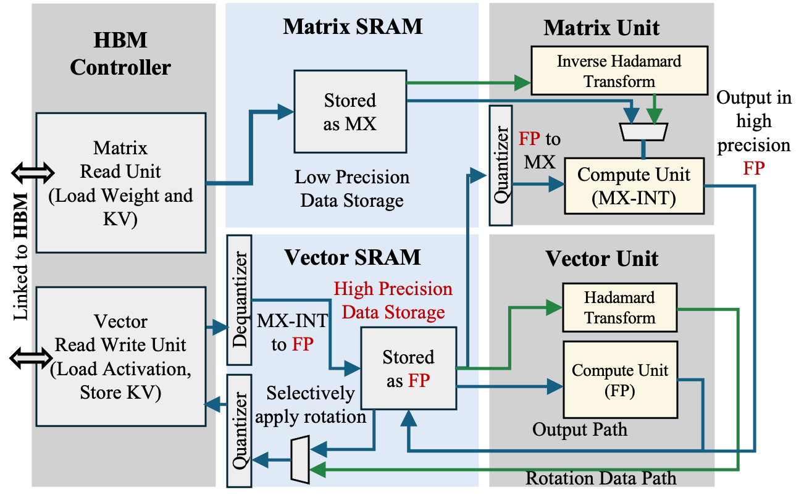

# PLENA Hardware Configuration

## Architecture Overview

PLENA is composed of the following major components:

- Matrix Unit: Handles GEMM, GEMV, and batched matrix multiplication (BMM) operations.
- Vector Unit: Supports vector operations.
- Scalar Unit: Supports integer and floating-point scalar operations, including special functions such as `exp`, `reci`, and `sqrt`.
- Matrix SRAM: Stores matrix data and connects directly to the Matrix Unit. It supports both transposed and non-transposed reads.
- Vector SRAM: Stores vector data and connects directly to the Vector Unit. It also acts as scratchpad memory for both the Matrix Unit and Vector Unit.
- Integer SRAM: Stores integer data, primarily address-related data.
- FP SRAM: Stores floating-point data and connects directly to the Scalar Unit.
- HBM Controller: Manages HBM access, including prefetch and writeback operations, using TileLink as the protocol.

---

## Compute


The compute subsystem consists of the Matrix, Vector, and Scalar units, orchestrated around a shared register file and parameterized by the core tile dimensions.

### Core Parameters

| Parameter | Value | Description |
|-----------|-------|-------------|
| MLEN | 64 | Matrix tile dimension |
| VLEN | 64 | Vector length |
| BLEN | 4 | Block length (output tile granularity) |
| HLEN | 16 | Head dimension for partitioned attention |
| BROADCAST_AMOUNT | 4 | Broadcast width |

### Execution Units

- Matrix Unit: BLEN × MLEN compute datapath with BLEN × BLEN output granularity
- Vector Unit: VLEN-wide (64) vector operations
- Scalar Unit: Integer/float scalar operations
- HBM Controller: High-bandwidth memory access

### Register File

#### General Purpose Registers
- gp0-gp15: 16 general purpose registers
- gp0 is hardwired to 0

#### Floating Point Registers
- f0-f7: 8 floating point registers

#### Address Registers
- a0-a7: 8 address registers for HBM access

### Matrix/Vector Length Constraints

| Constraint | Description |
|------------|-------------|
| `MLEN >= BLEN` | Matrix length must be at least block length |
| `MLEN = VLEN` | Matrix and vector lengths must match |
| `MLEN % BLEN == 0` | Matrix length must be divisible by block length |

---

## Memory


The memory subsystem spans on-chip SRAMs (Matrix, Vector, Integer, FP) and off-chip HBM, connected through a TileLink-based HBM controller that handles prefetch and writeback.

### On-Chip SRAM Sizes

| Memory | Config Value | Unit | Total Elements | Description |
|--------|--------------|------|----------------|-------------|
| Matrix SRAM | 1024 | tiles | 4,194,304 | Each tile = MLEN×MLEN = 4096 elements |
| Vector SRAM | 4,194,304 | rows | 268,435,456 | Each row = VLEN = 64 elements |

### Prefetch/Writeback Amounts

| Parameter | Value | Description |
|-----------|-------|-------------|
| HBM_M_Prefetch_Amount | 64 | Elements per H_PREFETCH_M (one MLEN row) |
| HBM_V_Prefetch_Amount | 4 | Rows per H_PREFETCH_V (BLEN rows) |
| HBM_V_Writeback_Amount | 4 | Rows per H_STORE_V (BLEN rows) |

### Preloaded Constants (FP_MEM)

FP_MEM is a small scalar memory for floating-point constants, preloaded before execution.
- Use `S_LD_FP` to load values into FP registers
- Contents are **workload-specific** (see workload prompt for exact values)
- FP_MEM[0] is always 0.0 across all workloads

### SRAM Depth Requirements

| Constraint | Description |
|------------|-------------|
| `MATRIX_SRAM_DEPTH >= 2 * MLEN` | Matrix SRAM needs 2x matrix length |
| `VECTOR_SRAM_DEPTH >= 2 * head_dim + (hidden_dim // VLEN)` | Vector SRAM based on model dimensions |
| `INT_SRAM_DEPTH >= num_hidden_layers * REPEAT_SETTINGS + FIXED_CONSTANT_NUM` | Integer SRAM for layer constants |
| `FP_SRAM_DEPTH >= 3 * MLEN + FP_CONSTANT_NUM` | FP SRAM for floating-point operations |

### HBM Prefetch Constraints

| Constraint | Description |
|------------|-------------|
| `HBM_M_Prefetch_Amount >= BLEN` | Matrix prefetch must be at least block length |
| `HBM_V_Prefetch_Amount >= BLEN` | Vector prefetch must be at least block length |

---

## Quantization



PLENA stores weights, activations, and KV cache in MXFP format off-chip, and dequantizes into BF16 on-chip for compute.

### On-Chip SRAM (Plain format)

| Memory | Format | Type | Description |
|--------|--------|------|-------------|
| Matrix SRAM | Plain | BF16 (E8M7) | Weights after dequantization |
| Vector SRAM | Plain | BF16 (E8M7) | Activations and outputs |
| Scalar FP | Plain | BF16 (E8M7) | FP register file |

### Off-Chip HBM (MXFP format)

| Data Type | Format | Element | Scale | Description |
|-----------|--------|---------|-------|-------------|
| Weights | MXFP | E4M3 | E8M0 | 8 elements share 1 scale |
| KV Cache | MXFP | E4M3 | E8M0 | 8 elements share 1 scale |
| Activations | MXFP | E4M3 | E8M0 | 8 elements share 1 scale |

**MXFP Note:** HBM size = logical_size × 1.125 (accounts for scale bytes)

### Precision Parameter Constraints

All precision formats must have power-of-two total bit widths:

```
is_power_of_two(WT_MXFP_MANT_WIDTH + WT_MXFP_EXP_WIDTH + 1) == True
is_power_of_two(ACT_MXFP_MANT_WIDTH + ACT_MXFP_EXP_WIDTH + 1) == True
is_power_of_two(KV_MXFP_MANT_WIDTH + KV_MXFP_EXP_WIDTH + 1) == True
```

Valid total bit widths: **2, 4, 8, 16, 32**

#### Example Valid Configurations

| Format | Mantissa | Exponent | Sign | Total |
|--------|----------|----------|------|-------|
| MXFP4 | 2 | 1 | 1 | 4 |
| MXFP8 | 4 | 3 | 1 | 8 |
| FP16 | 10 | 5 | 1 | 16 |

---

## Common Constraint Violations

| Error | Cause | Solution |
|-------|-------|----------|
| `MLEN < BLEN` | Block length too large | Reduce BLEN or increase MLEN |
| `MLEN % BLEN != 0` | Incompatible lengths | Choose MLEN as multiple of BLEN |
| `SRAM overflow` | Insufficient SRAM depth | Increase SRAM depth or reduce MLEN |
| `Invalid bit width` | Non-power-of-two width | Adjust mantissa/exponent widths |
