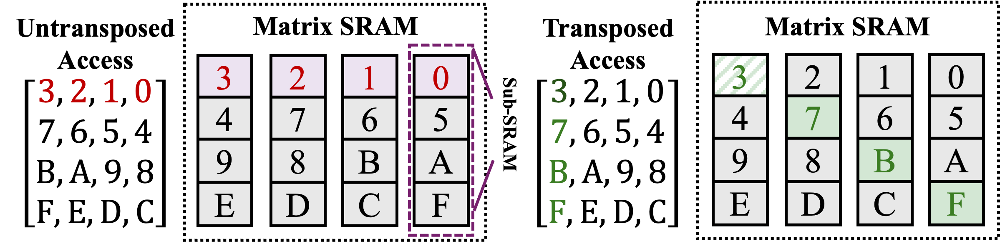

# PLENA Hardware Configuration

## Architecture Overview

PLENA is composed of the following major components:

- Matrix Unit: Handles GEMM, GEMV, and batched matrix multiplication (BMM) operations.
- Vector Unit: Supports vector operations.
- Scalar Unit: Supports integer and floating-point scalar operations, including special functions such as `exp`, `reci`, and `sqrt`.
- Matrix SRAM: Stores matrix data and connects directly to the Matrix Unit. It supports both transposed and non-transposed reads.
- Vector SRAM: Stores vector data and connects directly to the Vector Unit. It also acts as scratchpad memory for both the Matrix Unit and Vector Unit.
- Integer SRAM: Stores integer data, primarily address-related data.
- FP SRAM: Stores floating-point data and connects directly to the Scalar Unit.
- HBM Controller: Manages HBM access, including prefetch and writeback operations, using TileLink as the protocol.

---

## Compute Units

The compute subsystem consists of the Matrix, Vector, and Scalar units, orchestrated around a shared register file and parameterized by the core tile dimensions.

### Matrix Unit

The Matrix Unit is a systolic array that executes all dense linear-algebra primitives: GEMM (`M_MM` / `M_TMM`), GEMV (`M_MV` / `M_TMV`), and batched/partitioned matmul for multi-head attention (`M_BMM` / `M_BTMM`). Each GEMM call fetches a `(BLEN, MLEN)` tile from Vector SRAM and a `(MLEN, BLEN)` tile from Matrix SRAM, multiplies them, and accumulates the partial product inside the array. Results are drained to Vector SRAM in `BLEN × BLEN` chunks via `M_MM_WO`. The transposed variants (`M_TMM`, `M_TMV`) read the Matrix SRAM tile with a transposed address pattern, which lets the hardware consume HBM weights that are stored as `W.T` without an explicit transpose pass.

**Relevant parameters:**

- **MLEN** — Size of a square weight tile and the inner (K) dimension of each matmul step. Also sets the length of the accumulator row used by `M_MV` / `M_TMV`.
- **BLEN** — Output tile granularity. The array produces `BLEN × BLEN` results per drain and walks the K dimension in `BLEN`-column (or `MLEN × BLEN`-row, for transposed) strides.
- **HLEN** — Head tile size for partitioned attention. `M_BMM` / `M_BTMM` run `MLEN / HLEN` independent matmuls in parallel along this axis, mapping multi-head batches onto the array.

### Vector Unit

The Vector Unit operates on `VLEN`-wide vectors held in Vector SRAM and is responsible for all element-wise and reduction work that sits between matmuls: element-wise add/sub/mul with either another vector (`V_ADD_VV`, `V_SUB_VV`, `V_MUL_VV`) or a broadcast FP scalar (`V_ADD_VF`, `V_SUB_VF`, `V_MUL_VF`); element-wise nonlinearities `V_EXP_V` and `V_RECI_V` used by softmax, GELU, and layer norm; and cross-lane reductions `V_RED_SUM` and `V_RED_MAX` that collapse a `VLEN`-vector into an FP register. A mask register (`C_SET_V_MASK_REG`) can predicate any element-wise op, and an `rorder` flag lets `V_SUB_VF` run as `scalar − vector` for negation.

**Relevant parameters:**

- **VLEN** — Width of every vector operation and the natural granularity for Vector SRAM addressing (all vector read/write addresses must be `VLEN`-aligned). It also fixes the reduction width of `V_RED_SUM` / `V_RED_MAX`.
- **BROADCAST_AMOUNT** — Fan-out used when a single FP register is broadcast across the `VLEN` lanes in `V_*_VF` instructions.

### Scalar Unit

The Scalar Unit handles control-flow arithmetic and the small amount of FP math that lives outside the vector lanes. It covers integer ops on `gp0–gp15` (`S_ADD_INT`, `S_ADDI_INT`, `S_SUB_INT`, `S_MUL_INT`, `S_LUI_INT`) used for address computation and loop bookkeeping; FP ops on `f0–f7` (`S_ADD_FP`, `S_SUB_FP`, `S_MUL_FP`, `S_MAX_FP`) plus the special functions `S_EXP_FP`, `S_RECI_FP`, and `S_SQRT_FP` that back softmax normalizers and RMSNorm scales; and loads/stores against two small scratch memories — `INT_MEM` (via `S_LD_INT` / `S_ST_INT`) for integer constants and `FP_MEM` (via `S_LD_FP` / `S_ST_FP`) for preloaded FP constants. `S_MAP_V_FP` is the bridge from `FP_MEM` into a `VLEN`-wide Vector SRAM row.

**Relevant parameters:**

- **INT_SRAM_DEPTH** — Number of entries in `INT_MEM`; sized from `num_hidden_layers × REPEAT_SETTINGS + FIXED_CONSTANT_NUM` to hold all per-layer integer constants.
- **FP_SRAM_DEPTH** — Number of entries in `FP_MEM`; must be at least `3 × MLEN + FP_CONSTANT_NUM` to cover preloaded FP constants and staging space for `S_MAP_V_FP`.
- **16 GP registers / 8 FP registers / 8 HBM address registers** — Architectural register file visible to all scalar instructions (`gp0` is hardwired to 0, `f0` to 0.0).

## Registers

There are three types of registers in the PLENA architecture: general purpose registers, floating point registers, and address registers.

### General Purpose Registers
Mainly used for integer operations and address computation.
- gp0-gp15: 16 general purpose registers
- gp0 is hardwired to 0

### Floating Point Registers
Mainly used for scalarFP operations.
- f0-f7: 8 floating point registers
- f0 is hardwired to 0.0

### Address Registers
- a0-a7: 8 address registers for off-chip memory access

---

## Memory

The memory subsystem spans four on-chip SRAMs (Matrix, Vector, INT, FP) and off-chip HBM, linked by a TileLink-based memory controller that issues prefetch and writeback transactions on behalf of the compute units.

### On-Chip SRAM

- **Matrix SRAM** — Double-buffered weight and KV-cache store for tiles that are streamed in once per use and do not need to be kept hot. Load and drain ports operate concurrently, so the next tile can be prefetched from HBM while the current one feeds the systolic array. Its defining feature is a bank layout that serves both non-transposed and transposed reads at full bandwidth, letting `M_TMM` / `M_TMV` consume weights stored as `W.T` without a separate transpose pass and without duplicated storage or extra muxing.

- **Vector SRAM** — Primary scratchpad for activations and intermediate results. It sinks the `BLEN × BLEN` drains from the Matrix Unit and all Vector Unit outputs, and is the only SRAM that participates in HBM prefetch/writeback for activation traffic. All accesses are `VLEN`-aligned.

- **FP SRAM (`FP_MEM`)** — Small constant store for preloaded FP values (e.g. normalizer constants, `e`). Wired directly to the Scalar Unit through `S_LD_FP` / `S_ST_FP`, and bridged into Vector SRAM by `S_MAP_V_FP`. Depth is set by `FP_SRAM_DEPTH`.

- **INT SRAM (`INT_MEM`)** — Small constant store for integer values used in address computation, such as per-layer base offsets. Accessed only by the scalar integer path via `S_LD_INT` / `S_ST_INT`. Depth is set by `INT_SRAM_DEPTH`.

---

### On-Chip SRAM (Plain format)

| Memory | Format | Type | Description |
|--------|--------|------|-------------|
| Matrix SRAM | Plain | BF16 (E8M7) | Weights after dequantization |
| Vector SRAM | Plain | BF16 (E8M7) | Activations and outputs |
| Scalar FP | Plain | BF16 (E8M7) | FP register file |

### Off-Chip HBM (MXFP format)

| Data Type | Format | Element | Scale | Description |
|-----------|--------|---------|-------|-------------|
| Weights | MXFP | E4M3 | E8M0 | 8 elements share 1 scale |
| KV Cache | MXFP | E4M3 | E8M0 | 8 elements share 1 scale |
| Activations | MXFP | E4M3 | E8M0 | 8 elements share 1 scale |
