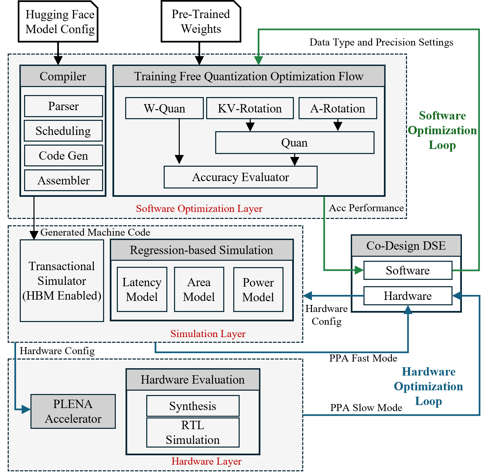

# Welcome to PLENA

**PLENA** is an open-source hardware-software co-designed system optimized for long-context LLM inference in agentic applications. It addresses the memory bandwidth and capacity walls that limit compute utilization during long-context workloads such as tool-use agents, web agents, and command-line agents.

<div style="text-align: center;">
  
</div>

---

## Project Structure

- [**PLENA_Compiler**](https://github.com/AICrossSim/PLENA_Compiler) — Compiler stack targeting the PLENA ISA
- [**PLENA_Simulator**](https://github.com/AICrossSim/PLENA_Simulator) — Cycle-emulated hardware simulator with complete verilator based simulation flow
- [**PLENA_RTL**](https://github.com/AICrossSim/PLENA_RTL) — Synthesizable SystemVerilog hardware design
- [**PLENA_Software**](https://github.com/AICrossSim/PLENA_Software) — Quantization tools and accuracy evalutator

## Publication

If you use PLENA in your research, please cite the following paper (to appear in ISCA 2026):

```bibtex
@misc{wu2025combatingmemorywallsoptimization,
    title={Combating the Memory Walls: Optimization Pathways for Long-Context Agentic LLM Inference},
    author={Haoran Wu and Can Xiao and Jiayi Nie and Xuan Guo and Binglei Lou and Jeffrey T. H. Wong and Zhiwen Mo and Cheng Zhang and Przemyslaw Forys and Wayne Luk and Hongxiang Fan and Jianyi Cheng and Timothy M. Jones and Rika Antonova and Robert Mullins and Aaron Zhao},
    year={2025},
    eprint={2509.09505},
    archivePrefix={arXiv},
    primaryClass={cs.AR},
    url={https://arxiv.org/abs/2509.09505},
}
```
