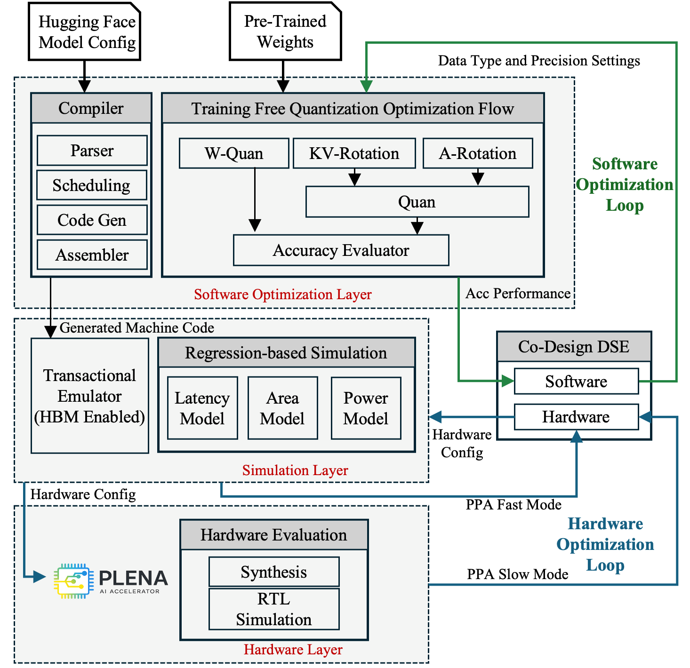

# Toolchain Overview

The PLENA toolchain is a full-stack framework that takes a Hugging Face model through software optimization, simulation, and hardware evaluation. A Co-Design DSE engine drives two coupled loops: a **Software Optimization Loop** tuning data type and precision against accuracy, and a **Hardware Optimization Loop** tuning the accelerator configuration against Power, Performance, and Area (PPA).

  

## Components

- **[Compiler](compiler.md)** — Lowers a Hugging Face model onto the PLENA stack and emits machine code for the accelerator.
- **[Accuracy Evaluator](accuracy_evaluator.md)** — Applies training-free quantization and measures model accuracy, closing the Software Optimization Loop.
- **[Transactional Emulator](transactional_emulator.md)** — Cycle-approximate, HBM-enabled simulator that executes the generated machine code.
- **[Analytic Model](analytic_model.md)** — Fast regression-based latency, area, and power models for rapid DSE inner-loop search.
- **[Co-Design Toolchain](co_design.md)** — DSE engine that jointly explores the software and hardware design space across both optimization loops.
